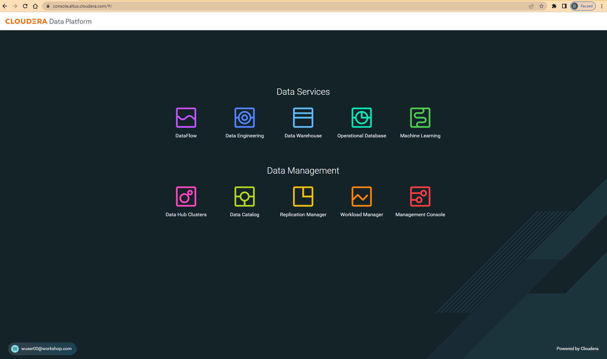

= Cloudera Technical Workshop

'''

Version : 1.0.0 `25th April 2023` +

'''

image:images/step0/bannerturkey.PNG[]  +

This document guides students through the Hands-on lab on of Cloudera Data Flow.
It will take you step by step to completing the pre-requisites and deliver this demo.

== Recording

The entire lab is recorded and you can watch the same to have a better understanding of the lab. +
https://fillin here[End-to-End Workshop (Recording)]. +

== Pre-Requisite (Taken Care By Instructor)

For the ease of carrying out the workshop and considering the time at hand, we have already taken care of some of the steps that need to be considered before we can start with the actual workshop steps. The prerequisites that need to be in place are: +
(1) Flow Management Data Hub Cluster should be created and running. +
(2) Streams Messaging Data Hub Cluster should be created and running. +
(3) Stream analytics Data Hub cluster should be created and running. +
(4) Data provider should be configured in SQL Stream Builder. +
(5) Have access to the file syslog-to-kafka.json. +
(6) Environment should be enabled as part of the CDF Data Service. +

Step 0 basically talks about verifying different aspects w.r.t to access and connections before we could begin with the actual steps.

== Step 1: Introduction & Set Up

=== Step 1.1: Access Verification

Your instructor will guide you through this. +
(1) https://docs.google.com/spreadsheets/d/1s63G-iBtgS8tDZOD1ml8Gh0YdunL4MtNqNzyN7E7gaY/edit#gid=412559706[Credentials]: Participants must enter their `First Name`, `Last Name` & `Company` details and make a note of corresponding `Workshop Login Username`, `Workshop Login Password` and `CDP Workload User` to be used in this workshop. +
(2) http://3.109.161.118/auth/realms/workshop/protocol/saml/clients/samlclient[Workshop login]: Using the details in the previous step make sure you are able to login here. +

=== Step 1.2: Verify permissions in Apache Ranger

*`NOTE: THESE STEPS HAVE ALREADY BEEN DONE FOR YOU, THIS SECTION WILL WALK YOU THROUGH HOW PERMISSIONS/POLICIES ARE MANAGED IN RANGER. PLEASE DO NOT EXECUTE THE STEPS IN THIS SECTION OR CHANGE ANYTHING.`*

==== Step 1.2.1: Accessing Apache Ranger +

Click on the `Management Console` icon. +
image:images/stepx/x.PNG[]  +

Click on the `Environments` tab on the left pane. +
image:images/stepx/x.PNG[]  +

Select the environment that is shared by the instructor (Ex: `pse-workshop`) and click on the Ranger quick link to access the Ranger UI. +
image:images/stepx/x.PNG[]  +
image:images/stepx/x.PNG[]  +

==== Step 1.2.2: Kafka Permissions +

In Ranger, select the Kafka repository that’s associated with the stream messaging datahub. +
image:images/stepx/x.PNG[]  +

Verify if the user group `workshop-users` (all users are part of this group) who will be performing the workshop is present in both `all-consumergroup` and `all-topic`. +

The below image reflects the group `workshop-users` being part of `all-consumergroup`. +
image:images/stepx/x.PNG[]  +

The below image reflects the group `workshop-users` being part of `all-topic`. +
image:images/stepx/x.PNG[]  +

==== Step 1.2.3: Schema Registry Permissions +
In Ranger, select the `SCHEMA-REGISTRY' repository that’s associated with the stream messaging datahub. +
image:images/stepx/x.PNG[]  +

Verify if the user group `workshop-users` (all users are part of this group) who will be performing the workshop is present in the Policy : all - `schema-group, schema-metadata, schema-branch, schema-version`. +
image:images/stepx/x.PNG[]  +
image:images/stepx/x.PNG[]  +
image:images/stepx/x.PNG[]  +

=== Step 1.3: Define Workload Password

Please use the login url: http://3.109.161.118/auth/realms/workshop/protocol/saml/clients/samlclient[Workshop login]. +
Enter the `Workshop Login Username` and `Workshop Login Password` that you obtained as part of `Step 0.1`. +
(*Note*: Note that your Workshop Login Username would be something like `wuser00@workshop.com` and not just `wuser00`). +

image:images/step1/1.PNG[]  +

You should be able to get the following home page of CDP Public Cloud. +

  +

You will need to define your workload password that will be used to acess non-SSO interfaces. Please keep a note of this workload password. If you have forgotten it, you will be able to repeat this process and define another one. +
You may read more about workload passwords https://docs.cloudera.com/management-console/cloud/user-management/topics/mc-access-paths-to-cdp.html[here].

. Click on your `user name (Ex: wuser00@workshop.com`) at the lower left corner.
. Click on the `Profile` option.

image:images/step4/1.PNG[]  +

. Click option `Set Workload Password`.
. Enter a suitable `Password` and `Confirm Password`.
. Click button `Set Workload Password`.

image:images/step4/2.PNG[]  +

image::images/step4/3.PNG[]

{blank} +

Check that you got the message - `Workload password is currently set` or alternatively, look for a message next to `Workload Password` which says `(Workload password is currently set)`

image::images/step4/4.PNG[] +

=== Step 1.4: Obtain the Kafka Broker List

We will require the broker list to configure our processors to connect to our Kafka brokers which allows consumers to connect  and fetch messages by partition, topic or offset. This information can be found in the Datahub cluster associated to the Streams Messaging Manager.

Access the Data Hub: Go to the environment that is shared by the INSTRUCTOR (Ex: `pse-workshop`). +
image:images/stepx/x.PNG[]  +

Click on the DataHub associated with Streams Messaging Manager (Ex: `kafka-smm-cluster`). +
image:images/stepx/x.PNG[]  +

Go to the Streams Messaging Interface. +
image:images/stepx/x.PNG[]  +

Select Brokers from the left tab. +
image:images/stepx/x.PNG[]  +

Save the name of the broker list in a notepad. +
image:images/stepx/x.PNG[]  +

Example: 

`kafka-smm-cluster-corebroker1.pko-hand.dp5i-5vkq.cloudera.site:9093` +
`kafka-smm-cluster-corebroker0.pko-hand.dp5i-5vkq.cloudera.site:9093` +
`kafka-smm-cluster-corebroker2.pko-hand.dp5i-5vkq.cloudera.site:9093` +

=== Step 1.5: Download Resources from GitHub
Scroll up the page here (https://github.com/DashDipti/cdf-workshop) and click on <> Code and then choose the option Download ZIP. +
image:images/stepx/x.PNG[]  +

Use any unzip utility to download extract the content of the partner-summit-2023-main.zip file. +
image:images/stepx/x.PNG[]  +

In the extracted content just be sure that the downloaded files has a file `syslog-to-kafka.json` which should be around ~25 KB in size. You will need this file in later step. +
image:images/stepx/x.PNG[]  +

=== Step 1.6: Unlock your KeyTab

[Attention:] xx - Additional screens to be added here for how to get to this page. +
image:images/stepx/x.PNG[]  +

Open the SSB UI. +
image:images/stepx/x.PNG[]  +

Click on the User name (Ex: `wuser00`) at the bottom left of the screen and select Manage Keytab. Make sure you are logged in as the username that was assigned to you. +
image:images/stepx/x.PNG[]  +

Enter your Workload Username under `Principal Name*` and workload password that you had set earlier (In `Step 1.3: Define Workload Password`) in the `Password` field. +
image:images/stepx/x.PNG[]  +

Click on `Unlock Keytab` and look for the message 'Success Keytab has been unclocked'.

== Step 2: Create a Flow using Flow Designer
Creating a data flow for CDF-PC is the same process as creating any data flow within Nifi with 3 very important steps:
- The data flow that would be used for CDF-PC must be self contained within a process group.
- Data flows for CDF-PC must use parameters for any property on a processor that is modifiable, e.g. user names, Kafka topics, etc.
- All queues need to have meaningful names (instead of Success, Fail, and Retry). These names will be used to define Key Performance Indicators in CDF-PC.

=== Step 2.1: Building the Data Flow using Flow Designer

==== Step 2.1.1: Create the canvas to design your flow
Access the `DataFlow` data service from the Management Console. +
image:images/stepx/x.PNG[]  +

Go to the `Flow Design`. +
image:images/stepx/x.PNG[]  +

Click on `Create Draft` (This will be the main process group for the flow that you'll create). +
image:images/stepx/x.PNG[]  +

Select the appropriate environment as part of the `Workspace` name (Ex: `pse-workshop`). *Note*: Please select the appropriate environment +
Give your flow a name with your username as prefix (Ex: `wuser00_datadump_flow`). +
Click on `CREATE`. +
image:images/stepx/x.PNG[]  +

On successful creation of the Draft, you should now be redirected to the canvas on which you can design your flow.
image:images/stepx/x.PNG[]  +

==== Step 2.1.2: Adding new parameters
Click on the `Flow Options` on the top right corner of your canvas and then select `Parameters`. +
image:images/stepx/x.PNG[]  +

Configure Parameters: Parameters are reused within the flow multiple times and will also be configurable at the time of deployment. +
There are 2 options available: `Add Parameter`, which is used for specifying non-sensitive values and `Add Sensitive Paramter`, which is used for specifying sensitive parameters like password. +

- Click on `Add Parameter`. +
image:images/stepx/x.PNG[]  +

Add the following parameters. +
`Name`: `S3 Directory`. +
`Value`: `LabData`. +
Click on `Apply`. +
image:images/stepx/x.PNG[]  +

- Click on `Add Parameter`. +
image:images/stepx/x.PNG[]  +

Add the following parameters. +
`Name`: `CDP Workload User`. +
`Value`: `The username assigned to you`. Ex: `wuser00`. +
Click on `Apply`. +
image:images/stepx/x.PNG[]  +

- Click on `Add Sensitive Parameter`. +
image:images/stepx/x.PNG[]  +

Add the following parameters. +
`Name`: `CDP Workload User Password`. +
`Value`: `Workload User password set by you in  'Step 1.3: Define Workload Password'`. +
Click on `Apply`. +
image:images/stepx/x.PNG[]  +

Click on `Apply Changes`. +
image:images/stepx/x.PNG[]  +

Click on 'Back to Flow Designer' +
image:images/stepx/x.PNG[]  +

Now that we have created these parameters, we can easily search and reuse them within our dataflow. This is useful for CDP Workload User and CDP Workload User Password. +
`*NOTE ONLY*: To search for existing parameters -
1. Open a processor's configuration and proceed to the properties tab.
2. Enter: #{.
3. Hit  'Ctrl+Spacebar'.

This will bring up a list of existing parameters that are not tagged as sensitive.`

==== Step 2.1.3: Create the flow
Let's go back to the canvas to start designing our flow.This flow will contain 2 Processors: +
`GenerateFlowFile`: Generates random data. +
`PutCDPObjectStore`: Loads data into HDFS(S3). +
Our final flow will look something like this. +
image:images/stepx/x.PNG[]  +

Add `GenerateFlowFile` processor: Pull the `Processor` onto the canvas and type `GenerateFlowFile` in the text box, and once the processor appears click on `Add`. +
image:images/stepx/x.PNG[]  +
image:images/stepx/x.PNG[]  +

Configure `GenerateFlowFile` processor: The `GenerateFlowFile` Processor will now be on your canvas and you can configure it by right clicking on it and selecting `Configuration`. +
image:images/stepx/x.PNG[]  +
Configure the processor in the following way. +
`Processor Name` : `DataGenerator` +
`Scheduling Strategy` : `Timer Driven` +
`Run Duration` : `0 ms` +
`Run Schedule` : `30 sec` +
`Execution` : `All Nodes` +
`Properties`: `Custom Text` +

[,sql]
----

<26>1 2021-09-21T21:32:43.967Z host1.example.com application4 3064 ID42 [exampleSDID@873 iut="4" eventSource="application" eventId="58"] application4 has 
stopped unexpectedly
----

The above represents a syslog out in RFC5424 format. Subsequent portions of this workshop will leverage this same syslog format. +

image:images/stepx/x.PNG[]  +
image:images/stepx/x.PNG[]  +

Click on 'Apply'. [Attention] - Screenshot might be needed. +
image:images/stepx/x.PNG[]  +

Add `PutCDPObjectStore` processor: Pull a new `Processor` onto the canvas and type `PutCDPObjectStore` in the text box, and once the processor appears click on `Add`. +
image:images/stepx/x.PNG[]  +
image:images/stepx/x.PNG[]  +

Configure `PutCDPObjectStore` processor: The `PutCDPObjectStore` Processor will now be on your canvas and you can configure it by right clicking on it and selecting `Configuration`. +
Click on 'Apply'. [Attention] - Screenshot might be needed. +
image:images/stepx/x.PNG[]  +
Configure the processor in the following way. +
`Processor Name` : `Move2S3` +
`Scheduling Strategy` : `Timer Driven` +
`Run Duration` : `0 ms` +
`Run Schedule` : `0 sec` +
`Execution` : `All Nodes` +
`Properties` +
	- `Directory` : `#{S3 Directory}` +
	- `CDP Username` : `#{CDP Workload User}` +
	- `CDP Password` : `#{CDP Workload User Password}` +
Relationships +
 - `Auto Terminate Relationships`: Check the `Terminate` box under `success`. +

==== Step 2.1.4: Renaming the queues

=== Step 2.1: Testing the flow

=== Step 2.2: Moving the flow to the flow catalog

=== Step 2.3: Deploying the flow

=== Step 2.4: Verifying flow deployment

== Step 3: Migrating Existing Data Flows to CDF-PC
The purpose of this workshop is to demonstrate how existing NiFi flows can be migrated to the Data Flow Experience. This workshop will leverage an existing NiFi flow template that has been designed with the best practices for CDF-PC flow deployment. +

The existing NiFi Flow will perform the following actions.
- Generate random syslogs in 5424 Format. +
- Convert the incoming data to a JSON using record writers. +
- Apply a SQL filter to the JSON records. +
- Send the transformed syslog messages to Kafka. +

Note that a parameter context has already been defined in the flow and the queues have been uniquely named. +

For this we will be leveraging the DataHubs which have already been created - `ssb-analytics-cluster`, `Nifi-flow-mgmt-cluster`, `kafka-smm-cluster`. +
`Note that the above names might be different depending upon your environment.`

=== Step 3.1: Create a Kafka Topic

=== Step 3.2: Create a Schema in Schema Registry

== Step 4: Operationalizing Externally Developed Data Flows with CDF-PC

=== Step 4.1: Import the Flow into the CDF-PC Catalog

=== Step 4.2: Deploy the Flow in CDF-PC

== Step 5: SQL Stream Builder (SSB)
The purpose of this workshop is to demonstrate streaming analytic capabilities using SQL Stream Builder. We will leverage the NiFi Flow deployed in CDF-PC from the previous workshop and demonstrate how to query live data and subsequently sink it to another location. The SQL query will leverage the existing syslog schema in Schema Registry. +

===== Misc Help ======
[,sql]
----

CREATE DATABASE <user>_stocks;
----